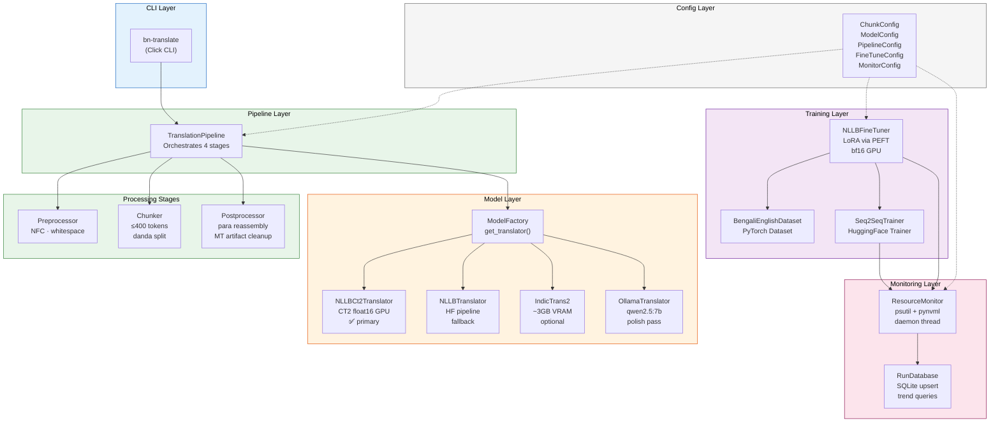
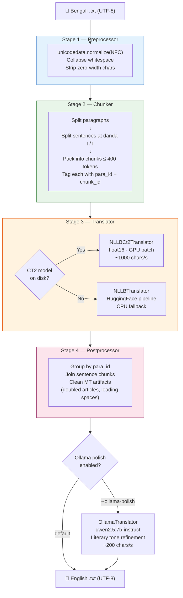
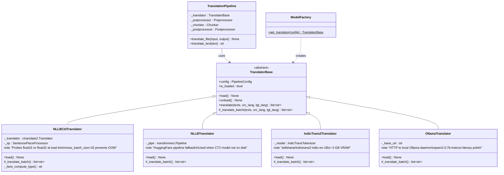
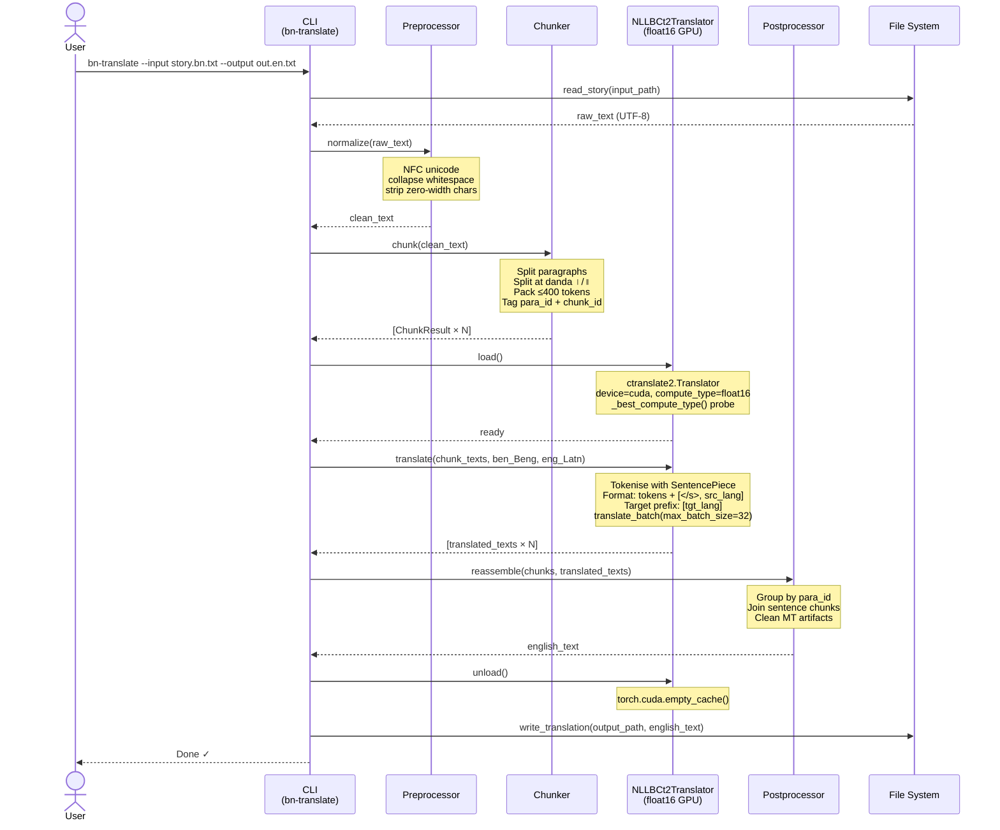

# Architecture

## Component Overview

The system is organised into six layers. Each layer has a single responsibility and communicates with adjacent layers through well-defined interfaces.



---

## 4-Stage Translation Pipeline

Each translation request passes through four deterministic stages. The stages are stateless pure functions (except the Translator, which holds GPU state).



---

## Class Hierarchy



---

## Sequence Diagram — Single Translation Request



---

## Layer Descriptions

### Config Layer (`config.py`)

Five dataclasses, all validated at construction time — no lazy validation. Invalid values raise `ValueError` immediately.

```python
ChunkConfig(max_tokens_per_chunk=400, batch_size=8, min_chunk_sentences=1, overlap_sentences=0)
ModelConfig(model_name="nllb-600M", device="cuda", compute_type="int8", beam_size=4)
PipelineConfig(model=ModelConfig(), chunk=ChunkConfig(), ollama_polish=False)
FineTuneConfig(lora_r=16, lora_alpha=32, num_epochs=3, learning_rate=2e-4, fp16=True)
MonitorConfig(sample_interval_s=2.0, db_path=Path("monitor/runs.db"), gpu_backend="pynvml")
```

`ModelConfig.device` accepts `"auto"` — resolved to `"cuda"` or `"cpu"` at load time. `ModelConfig.compute_type` is overridden at runtime by `_best_compute_type()` regardless of what the config says; it exists to allow CPU-path overrides.

### Model Layer (`models/`)

All translators implement `TranslatorBase`, which enforces a three-phase lifecycle:

```
instantiate → load() → translate() [×N] → unload()
```

`TranslatorBase.translate()` raises `RuntimeError` if called before `load()`. All implementations support the context-manager protocol (`with translator:`), which calls `load()` on entry and `unload()` on exit.

**Factory routing** (`factory.py`):

```
get_translator(config)
├── model_name = "nllb-600M" or "nllb-1.3B"
│   ├── models/nllb-{N}-ct2/ exists? → NLLBCt2Translator
│   └── else                          → NLLBTranslator (HuggingFace)
├── model_name = "indicTrans2-1B"
│   ├── models/indicTrans2-1B-ct2/ exists? → IndicTrans2Ct2Translator
│   └── else                                → IndicTrans2Translator (HuggingFace)
└── model_name = "ollama"              → OllamaTranslator
```

**CTranslate2 source tokenisation format (M2M-100 / NLLB):**

```
[text_tokens..., </s>, src_lang_token]
```

Target prefix: `[tgt_lang_token]` (forces the output language as BOS). Using `[src_lang, text_tokens...]` (reversed) produces degenerate looping output with no error.

**Compute type probe** (`_best_compute_type()`):  
On CUDA, the method runs a real ~20-token translation with each compute type in preference order (`int8_float16 → int8 → float16 → bfloat16 → float32`) and returns the first one that succeeds. Short probes (fewer than ~15 tokens) do not trigger the INT8 cuBLAS matmuls that fail on sm_120, so they produce false positives. The probe uses a sentence of ~20 tokens to avoid this.

### Pipeline Layer (`pipeline/`)

`TranslationPipeline` composes the four stages. It is stateless between calls — the same instance can translate multiple texts while the translator remains loaded.

**Chunker invariants:**
- Never splits mid-sentence (splits only at danda `।`/`॥` or paragraph boundary)
- Each chunk is at most `max_tokens_per_chunk` tokens (default 400), keeping it inside the model's 512-token context window
- Token estimation uses ~4.5 chars/token (Bengali multi-byte UTF-8 average)
- Returns `ChunkResult(text, para_id, chunk_id, sentence_start, sentence_end)` — `para_id` drives reassembly

**Postprocessor invariants:**
- Output paragraph count always equals input paragraph count
- Strips leading/trailing whitespace per paragraph
- Collapses repeated articles (`the the` → `the`)

### Training Layer (`training/`)

`NLLBFineTuner` wraps the HuggingFace base model with PEFT LoRA adapters and drives `Seq2SeqTrainer`. It always loads on CPU first to avoid CUDA device errors on sm_120, then moves to GPU after LoRA wrapping. After training, `export_ct2()` merges the adapters into the base weights via `merge_and_unload()` and converts the result to CTranslate2 float16.

### Monitoring Layer (`utils/`)

`ResourceMonitor` is a context manager that starts a daemon thread on `__enter__` which samples CPU, RAM, swap, and GPU metrics every `sample_interval_s` seconds using `psutil` and `pynvml`. On `__exit__`, it stops the thread, computes disk I/O delta, and builds a `ResourceSummary`. The summary is then persisted to `RunDatabase` (SQLite) via `save_run()`.

---

## Key Invariants

These must never be broken. Tests enforce them.

1. `TranslatorBase.translate()` raises `RuntimeError` if called before `load()`
2. `Chunker.chunk()` never splits mid-sentence (only at danda or paragraph boundary)
3. `reassemble()` output has the same paragraph count as the normalised input
4. All file I/O uses `encoding="utf-8"` explicitly — no reliance on locale
5. All compute type selection goes through `_best_compute_type()` — never hardcode `"int8"` on CUDA
6. NLLB source format is always `tokens + ["</s>", src_lang]` — never `[src_lang, tokens...]`
7. Training always loads the base model on CPU before moving to GPU

---

## Data Flow

### Translation data flow

```
raw Bengali text (UTF-8)
  → NFC normalise + whitespace collapse
  → split into paragraphs
  → split paragraphs into sentences at danda ।/॥
  → pack sentences into ChunkResult objects (≤400 tokens each, tagged with para_id)
  → batch chunks (batch_size=8) → SentencePiece tokenise
  → CT2 translate_batch (tokens + [</s>, src_lang] → [tgt_lang, output_tokens])
  → SentencePiece decode → strip leading tgt_lang token
  → group translated chunks by para_id
  → join and clean MT artifacts per paragraph
  → emit UTF-8 English text (same paragraph count as input)
```

### Training data flow

```
Samanantar pairs (bn.txt / en.txt)
  → filter by length (≤256 tokens each side)
  → 80/10/10 train/val/test split
  → BengaliEnglishDataset → tokenise with HF AutoTokenizer
  → Seq2SeqTrainer (LoRA-wrapped NLLB-600M, bf16, batch=8, grad_accum=4)
  → checkpoint every 500 steps → best-model restore (lowest eval_loss)
  → adapter saved to models/nllb-600M-finetuned/adapter/
  → PEFT merge_and_unload → ct2-transformers-converter → float16 CT2 model
```

---

## VRAM Budget (8 GB RTX 5050)

| Configuration | Load | Inference | Headroom |
|---|---|---|---|
| NLLB-600M CT2 float16 | ~2.0 GB | ~2.1 GB | ~5.9 GB |
| NLLB-1.3B CT2 float16 | ~2.6 GB | ~2.7 GB | ~5.3 GB |
| IndicTrans2-1B CT2 float16 | ~3.0 GB | ~3.1 GB | ~4.9 GB |
| Ollama qwen2.5:7b | ~4.7 GB | ~4.7 GB | ~3.3 GB |
| IndicTrans2 + Ollama | ~7.7 GB | OOM risk | unload before switching |

The pipeline unloads the translator before running the Ollama polish pass when `--ollama-polish` is set.

---

## Extension Points

### Adding a new model backend

1. Create `src/bn_en_translate/models/<name>_ct2.py` extending `TranslatorBase`
2. Implement `load()`, `unload()`, `_translate_batch()`
3. In `load()`: load SPM first, call `_best_compute_type(device, sp)`, then load CT2 Translator
4. Use the M2M source format: `tokens + ["</s>", src_lang]`
5. Register in `factory.py` with CT2-first path check
6. Add to `scripts/download_models.py` MODELS dict
7. Write unit tests for tokenisation format and compute type probe

### Adding a new pipeline stage

1. Write a pure function in `pipeline/` (e.g., `quality_filter.py`)
2. Add a field to `PipelineConfig` if it needs configuration
3. Wire into `TranslationPipeline.translate()` between existing stages
4. Unit test the function independently; integration test via mock pipeline
