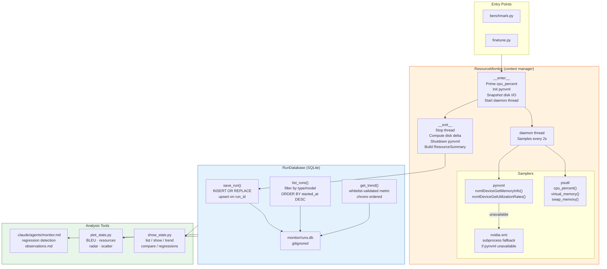

# Resource Monitoring Guide

The monitoring system records CPU, RAM, swap, disk I/O, and GPU metrics for every benchmark and fine-tune run, persists them to SQLite, and provides tools for trend analysis and regression detection.

---

## Monitoring Architecture



---

## How ResourceMonitor Works

`ResourceMonitor` is a context manager in `src/bn_en_translate/utils/monitor.py`. Typical usage:

```python
from bn_en_translate.utils.monitor import ResourceMonitor
from bn_en_translate.utils.run_db import RunDatabase

with ResourceMonitor() as monitor:
    # ... run benchmark or fine-tuning ...
    pass

summary = monitor.summary  # ResourceSummary with peak/avg stats

with RunDatabase() as db:
    db.save_run(
        run_id=monitor.run_id,
        run_type="benchmark",
        model_name="nllb-600M",
        started_at=monitor.started_at,
        finished_at=datetime.now(timezone.utc),
        summary=summary,
        bleu_score=42.5,
        chars_per_sec=1024.0,
    )
```

### `__enter__` sequence

1. Records `started_at` (UTC) and `_start_time` (monotonic).
2. Snapshots disk I/O counters as a baseline (via `psutil.disk_io_counters()`).
3. Initialises `pynvml` (calls `nvmlInit()` and gets device handle for GPU 0). Falls back silently to `nvidia-smi` subprocess if pynvml is unavailable.
4. Primes `psutil.cpu_percent()` with a 0.1s interval call (first call always returns 0.0 and must be discarded).
5. Starts a daemon thread named `resource-monitor` that calls `_sampling_loop()`.

### Sampling loop

The daemon thread calls `_take_sample()` every `sample_interval_s` seconds (default 2.0s) using `threading.Event.wait()` with a timeout. Each call produces a `ResourceSample`:

```python
ResourceSample(
    timestamp=time.monotonic(),
    cpu_pct=psutil.cpu_percent(interval=None),
    ram_mib=virtual_memory().used / 1024**2,
    swap_mib=swap_memory().used / 1024**2,
    gpu_vram_mib=pynvml.nvmlDeviceGetMemoryInfo(handle).used / 1024**2,
    gpu_util_pct=pynvml.nvmlDeviceGetUtilizationRates(handle).gpu,
)
```

If `gpu_util_pct` is `-1.0`, GPU data was unavailable for that sample.

The thread is a daemon thread: if the process exits without calling `__exit__`, the thread dies automatically and no partial data is written.

### `__exit__` sequence

1. Sets the stop event — the sampling thread exits at its next wakeup.
2. Joins the thread with a 5-second timeout.
3. Computes disk I/O delta (bytes read/written during the run).
4. Calls `pynvml.nvmlShutdown()`.
5. Calls `ResourceSummary.from_samples()` to aggregate all collected samples.

### GPU backend selection

The backend is controlled by `MonitorConfig.gpu_backend`:

| Backend | Behaviour |
|---------|-----------|
| `"pynvml"` (default) | Uses `pynvml` library. Falls back to `nvidia-smi` subprocess if init fails. |
| `"nvidia-smi"` | Always uses subprocess. Slower but more portable. |
| `"none"` | GPU stats disabled. Returns `(0.0, -1.0)` for all GPU samples. |

### Disabling monitoring

Set `MonitorConfig(enabled=False)` to make `ResourceMonitor` a complete no-op (the context manager returns immediately with no thread started and `summary` remains `None`).

---

## ResourceSummary Fields

`ResourceSummary` is a dataclass produced by `ResourceSummary.from_samples()`.

| Field | Type | Description |
|-------|------|-------------|
| `sample_count` | `int` | Total number of samples collected |
| `duration_s` | `float` | Wall-clock run duration in seconds |
| `cpu_peak_pct` | `float` | Peak CPU utilisation (0–100) |
| `cpu_avg_pct` | `float` | Mean CPU utilisation |
| `ram_peak_mib` | `float` | Peak RAM used (MiB) |
| `ram_avg_mib` | `float` | Mean RAM used (MiB) |
| `swap_peak_mib` | `float` | Peak swap used (MiB) |
| `swap_avg_mib` | `float` | Mean swap used (MiB) |
| `disk_read_mb` | `float` | Total MB read during the run (delta) |
| `disk_write_mb` | `float` | Total MB written during the run (delta) |
| `gpu_vram_peak_mib` | `float` | Peak VRAM used (MiB); 0.0 if GPU unavailable |
| `gpu_vram_avg_mib` | `float` | Mean VRAM used (MiB) |
| `gpu_util_peak_pct` | `float` | Peak GPU utilisation (0–100); 0.0 if unavailable |
| `gpu_util_avg_pct` | `float` | Mean GPU utilisation (excludes samples where GPU was unavailable) |

An empty sample list (monitoring disabled, or run too short) returns a zero-valued summary.

---

## RunDatabase Schema

Database at `monitor/runs.db` (SQLite, gitignored). Auto-created on first use.

```sql
CREATE TABLE IF NOT EXISTS runs (
    id                  INTEGER PRIMARY KEY AUTOINCREMENT,
    run_id              TEXT    NOT NULL UNIQUE,   -- UUID4 hex, natural key
    run_type            TEXT    NOT NULL,           -- 'benchmark' | 'finetune' | 'translate'
    model_name          TEXT    NOT NULL,
    started_at          TEXT    NOT NULL,           -- ISO 8601 UTC
    finished_at         TEXT,
    duration_s          REAL,
    status              TEXT    NOT NULL DEFAULT 'ok',
    error_msg           TEXT,

    -- Quality / throughput
    input_chars         INTEGER,
    bleu_score          REAL,
    chars_per_sec       REAL,

    -- CPU
    cpu_peak_pct        REAL,
    cpu_avg_pct         REAL,

    -- RAM (MiB)
    ram_peak_mib        REAL,
    ram_avg_mib         REAL,

    -- Swap (MiB)
    swap_peak_mib       REAL,
    swap_avg_mib        REAL,

    -- Disk I/O (MB delta)
    disk_read_mb        REAL,
    disk_write_mb       REAL,

    -- GPU
    gpu_vram_peak_mib   REAL,
    gpu_vram_avg_mib    REAL,
    gpu_util_peak_pct   REAL,
    gpu_util_avg_pct    REAL,

    -- Sampling metadata
    sample_count        INTEGER,
    sample_interval_s   REAL
);
```

Indexes: `run_type`, `model_name`, `started_at`.

`save_run()` uses `INSERT OR REPLACE` (upsert on `run_id`), so re-running a benchmark with the same `run_id` overwrites the previous record.

### Python query examples

```python
from bn_en_translate.utils.run_db import RunDatabase

with RunDatabase() as db:
    # All benchmark runs, most recent first
    rows = db.list_runs(run_type="benchmark", limit=10)

    # BLEU trend for NLLB-600M benchmarks
    points = db.get_trend("bleu_score", run_type="benchmark", model_name="nllb-600M", limit=20)
    # Returns: [("2026-04-01T10:00:00+00:00", 56.2), ...]

    # Single run detail
    row = db.get_run("abc123def456...")

    # Count all finetune runs
    n = db.count_runs(run_type="finetune")
```

---

## `show_stats.py` CLI Reference

```bash
python scripts/show_stats.py [--db PATH] COMMAND [OPTIONS]
```

Default database: `monitor/runs.db`.

### `list` — Show recent runs

```bash
python scripts/show_stats.py list [--run-type TYPE] [--model NAME] [--limit N]
```

Displays a summary table with columns: run_id (first 12 chars), run_type, model_name, started_at, duration_s, bleu_score, gpu_vram_peak_mib, ram_peak_mib, status.

```bash
python scripts/show_stats.py list
python scripts/show_stats.py list --run-type benchmark --model nllb-600M --limit 10
python scripts/show_stats.py list --run-type finetune
```

### `show` — Full detail for one run

```bash
python scripts/show_stats.py show RUN_ID
```

Accepts a full UUID4 hex string or any unique prefix. Prints all fields in a formatted layout.

```bash
python scripts/show_stats.py show abc123de
```

### `trend` — Metric over time

```bash
python scripts/show_stats.py trend METRIC [--run-type TYPE] [--model NAME] [--limit N]
```

Renders an ASCII bar chart of the metric value over time (oldest to newest).

```bash
python scripts/show_stats.py trend bleu_score
python scripts/show_stats.py trend gpu_vram_peak_mib --run-type benchmark --model nllb-600M
python scripts/show_stats.py trend duration_s --limit 30
```

Valid METRIC values: `bleu_score`, `chars_per_sec`, `duration_s`, `cpu_peak_pct`, `cpu_avg_pct`, `ram_peak_mib`, `ram_avg_mib`, `swap_peak_mib`, `swap_avg_mib`, `disk_read_mb`, `disk_write_mb`, `gpu_vram_peak_mib`, `gpu_vram_avg_mib`, `gpu_util_peak_pct`, `gpu_util_avg_pct`.

### `compare` — Side-by-side comparison

```bash
python scripts/show_stats.py compare RUN_ID_A RUN_ID_B
```

Displays a delta table for: BLEU, duration, chars/s, CPU peak, RAM peak, VRAM peak, GPU util peak, swap peak, disk read.

```bash
python scripts/show_stats.py compare abc123 def456
```

### `regressions` — Automated regression detection

```bash
python scripts/show_stats.py regressions [--run-type TYPE] [--model NAME] [--lookback N]
```

Compares the latest run's metrics against the rolling average of the prior `N` runs (default 5). Reports WARNING and CRITICAL findings.

```bash
python scripts/show_stats.py regressions
python scripts/show_stats.py regressions --run-type benchmark --model nllb-600M --lookback 10
```

Exits with code `0` if no critical regressions; exits `1` if any CRITICAL threshold is breached.

---

## `plot_stats.py` Reference

```bash
python scripts/plot_stats.py [--run-type TYPE] [--limit N]
```

Generates all charts and saves PNGs to `monitor/plots/`. Requires `matplotlib`.

| Output file | Content |
|-------------|---------|
| `bleu_over_runs.png` | BLEU score per benchmark run (bar chart, colour-coded: blue ≥60, orange ≥40, red <40). Includes BLEU≥25 threshold line. |
| `resource_usage.png` | CPU, RAM, VRAM, and GPU utilisation per run (grouped bar or line chart). |
| `duration_vs_input.png` | Scatter plot of translation duration vs input character count. |
| `finetune_loss.png` | Training loss over fine-tune runs (line chart). |
| `radar_latest.png` | Radar/spider chart of the latest run's full resource profile (normalised). |

```bash
# All plots, all runs
python scripts/plot_stats.py

# Only benchmark runs
python scripts/plot_stats.py --run-type benchmark

# Last 20 runs
python scripts/plot_stats.py --limit 20
```

If `monitor/runs.db` does not exist, the script exits with an error and a message to run a benchmark first.

---

## Regression Thresholds

These are the built-in thresholds in `show_stats.py regressions`:

| Metric | Threshold | Direction | Severity |
|--------|-----------|-----------|----------|
| `bleu_score` | drop ≥ 1.0 | higher is better | WARNING |
| `bleu_score` | drop ≥ 3.0 | higher is better | CRITICAL |
| `duration_s` | rise ≥ 20% | lower is better | WARNING |
| `gpu_vram_peak_mib` | rise ≥ 200 MiB | lower is better | WARNING |
| `ram_peak_mib` | rise ≥ 500 MiB | lower is better | WARNING |
| `chars_per_sec` | drop ≥ 15% | higher is better | WARNING |

Only WARNING and CRITICAL are defined. CRITICAL triggers a non-zero exit code for use in CI pipelines.

---

## Invoking the Monitor Claude Code Agent

The monitor agent reads run history, detects regressions, and appends structured observations to `monitor/observations.md`.

### When to invoke

- After any benchmark run where BLEU or throughput may have changed
- After fine-tuning completes (compare pre/post BLEU)
- After upgrading dependencies (PyTorch, CTranslate2, transformers)
- After hardware or configuration changes

### How to invoke

The agent is defined at `.claude/agents/monitor.md`. In a Claude Code session:

1. Ensure `monitor/runs.db` exists (run a benchmark first if not).
2. Use the Agent tool in Claude Code referencing `.claude/agents/monitor.md`, or invoke it via the configured slash command.
3. The agent will:
   - Run `python scripts/show_stats.py regressions`
   - Run `python scripts/show_stats.py list --limit 5`
   - Analyse trends in key metrics
   - Append dated observations to `monitor/observations.md`

### Checking observations

```bash
# View the latest observations
cat monitor/observations.md
```

The observations file is append-only and timestamped. It serves as a running log of notable performance changes, regressions, and improvements across sessions.
