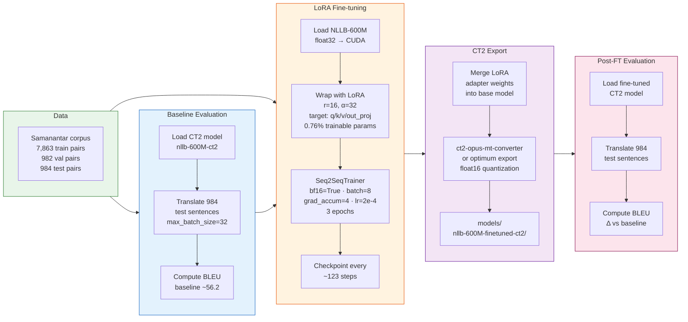

# Training Guide

Fine-tuning adapts the pre-trained NLLB-600M model to produce better Bengali-to-English translations on domain-specific text, using Low-Rank Adaptation (LoRA) for parameter efficiency.

---

## Training Pipeline Overview



---

## What LoRA Is and Why It Is Used

**Full fine-tuning** updates all ~600 million parameters of NLLB-600M. This requires storing a full copy of the model's gradients and optimizer states, consuming ~6–8 GB VRAM for a 600M-parameter model — more than the RTX 5050's 8 GB budget.

**LoRA (Low-Rank Adaptation)** instead freezes all pre-trained weights and injects small trainable rank-decomposition matrices into a subset of attention layers. For a weight matrix `W ∈ R^(d×k)`, LoRA adds `ΔW = B × A` where `A ∈ R^(r×k)` and `B ∈ R^(d×r)`, with rank `r << min(d, k)`. Only `A` and `B` are trained.

With `r=16` targeting 4 attention projection matrices (`q_proj`, `v_proj`, `k_proj`, `out_proj`), only ~0.76% of parameters are trainable. This reduces:
- Trainable parameter VRAM by ~99%
- Optimizer state VRAM proportionally
- Training time significantly

**PEFT** (Parameter-Efficient Fine-Tuning, from HuggingFace) is the library that provides the `LoraConfig` and `get_peft_model()` API used here.

After training, the LoRA adapter matrices are merged back into the base weights via `merge_and_unload()`, producing a standard HuggingFace model that can be converted to CTranslate2.

---

## FineTuneConfig Parameters

All parameters live in `src/bn_en_translate/config.py` under `FineTuneConfig`.

| Parameter | Default | Description |
|-----------|---------|-------------|
| `learning_rate` | `2e-4` | Peak learning rate for AdamW. LoRA typically needs a higher LR than full fine-tuning. |
| `num_epochs` | `3` | Number of full passes over the training set. More epochs risk overfitting on small corpora. |
| `train_batch_size` | `8` | Samples per GPU per step. Reduce to `4` if VRAM is tight during training. |
| `eval_batch_size` | `16` | Samples per step during evaluation (no gradients, so larger is fine). |
| `gradient_accumulation_steps` | `4` | Accumulate gradients over N micro-batches before an optimizer step. Effective batch size = `train_batch_size × gradient_accumulation_steps = 32`. |
| `warmup_steps` | `100` | Linear LR warmup from 0 to `learning_rate` over this many steps. Prevents large updates early in training. |
| `weight_decay` | `0.01` | L2 regularisation on non-bias parameters. Mild regulariser for LoRA. |
| `max_grad_norm` | `1.0` | Gradient clipping threshold. Prevents exploding gradients. |
| `lora_r` | `16` | LoRA rank. Higher rank = more capacity, more VRAM and compute. 16 is the standard starting point. |
| `lora_alpha` | `32` | LoRA scaling factor. The effective LoRA contribution is `(lora_alpha / lora_r) × ΔW`. With `alpha=32, r=16`, the scale is 2.0. |
| `lora_dropout` | `0.1` | Dropout applied to LoRA activations during training. Acts as regularisation. |
| `lora_target_modules` | `["q_proj", "v_proj", "k_proj", "out_proj"]` | Which attention projections to adapt. Targeting all four gives full attention coverage. |
| `max_source_length` | `256` | Maximum Bengali input tokens. Sequences are truncated to this length. |
| `max_target_length` | `256` | Maximum English output tokens. |
| `output_dir` | `"models/nllb-600M-finetuned"` | Directory for checkpoints and adapter weights. |
| `save_steps` | `500` | Save a checkpoint every N optimizer steps. |
| `eval_steps` | `500` | Run validation every N optimizer steps. |
| `logging_steps` | `100` | Log training loss every N steps. |
| `fp16` | `True` | Use bf16 precision on CUDA (see note below). Falls back gracefully to float32 on CPU. |

---

## Step-by-Step: Running Fine-tuning

### 1. Install dependencies

```bash
source .venv/bin/activate
pip install -e ".[train]"
```

### 2. Verify GPU training is available (requires PyTorch cu128)

```bash
python3 -c "
import torch
t = torch.tensor([1, -100, 3]).cuda().ne(-100)
print('GPU training probe: OK', t)
"
```

If this fails with `no kernel image`, install PyTorch cu128:

```bash
pip install torch --index-url https://download.pytorch.org/whl/cu128
```

### 3. Download the training corpus

```bash
python scripts/download_corpus.py
# Downloads ~10 000 Bengali-English pairs from ai4bharat/samanantar
# Splits into corpus/samanantar/train|val|test
```

### 4. Run fine-tuning

```bash
# Full run — ~20-30 min on RTX 5050 with GPU
python scripts/finetune.py

# With explicit settings
python scripts/finetune.py \
    --epochs 3 \
    --lr 2e-4 \
    --train-batch-size 4 \
    --grad-accum 8 \
    --lora-r 16 \
    --output-dir models/nllb-600M-finetuned \
    --ct2-output models/nllb-600M-finetuned-ct2

# CPU smoke test (slow, for CI / no-GPU environments)
python scripts/finetune.py --epochs 1 --max-train-pairs 500 --skip-baseline
```

### What happens at each step

| Step | What `finetune.py` does |
|------|------------------------|
| Baseline | Loads `models/nllb-600M-ct2/`, translates 984 test sentences, computes BLEU. Records result to `monitor/runs.db`. |
| Load | `NLLBFineTuner.load()` — loads NLLB-600M from HuggingFace in float32 on CPU, enables gradient checkpointing, wraps with PEFT LoRA adapters, moves to CUDA. |
| Train | `NLLBFineTuner.train()` — creates `BengaliEnglishDataset` for train/val, constructs `Seq2SeqTrainingArguments` with bf16, runs `Trainer.train()`, saves best checkpoint, saves adapter to `output_dir/adapter/`. |
| Export | `NLLBFineTuner.export_ct2()` — merges LoRA adapters into base weights, saves merged HF model to a temp directory, runs `ct2-transformers-converter --quantization float16`, copies SPM tokenizer into CT2 output dir. |
| Post-eval | Loads the fine-tuned CT2 model, translates the same 984 test sentences, computes BLEU, records to `monitor/runs.db`. |

### 5. Use the fine-tuned model

```bash
bn-translate --input story.bn.txt --output story.en.txt \
    --model nllb-600M --model-path models/nllb-600M-finetuned-ct2
```

---

## CT2 Export Details

`export_ct2()` in `trainer.py` performs these steps in sequence:

1. Call `self._peft_model.merge_and_unload()` — PEFT merges each LoRA `A × B` matrix into the corresponding frozen weight `W`, producing a standard `transformers` model with no PEFT dependencies.
2. Save merged model to a `tempfile.TemporaryDirectory`.
3. Run `ct2-transformers-converter --model <tmpdir> --output_dir <output_dir> --quantization float16 --force`. This converts all weight tensors to float16 and writes the CTranslate2 binary format.
4. Copy `sentencepiece.bpe.model` from the merged model temp directory into the CT2 output directory. CTranslate2 requires the tokenizer to be co-located with the model weights.

The script tries two invocation methods: `python -m ctranslate2.tools.transformers` first, then the `ct2-transformers-converter` CLI entry point.

---

## bf16 vs fp16 — Why bf16 Is Used

`Seq2SeqTrainingArguments` receives `bf16=True, fp16=False`.

**The problem with fp16 + LoRA:**  
PyTorch's fp16 AMP (`GradScaler`) scales loss values to prevent underflow in float16 gradients. However, when the model's base weights are loaded in float32 (as they are here, to avoid CUDA init errors) and only the LoRA adapter parameters are float16, `GradScaler` can produce incorrect scale factors because it observes mixed dtypes across the parameter groups. This leads to `nan` gradients and training divergence.

**Why bf16 works:**  
bfloat16 has the same exponent range as float32 (8-bit exponent vs float16's 5-bit). This means gradient underflow is rare, and `GradScaler` is not needed. On Blackwell (sm_120) hardware, bf16 tensor cores are natively supported by PyTorch `2.7.0+cu128`.

**CPU fallback:**  
When running on CPU (`self._use_cuda = False`), both `bf16` and `fp16` are set to `False` and the model runs in float32.

---

## GPU Requirements and VRAM Budget

| Phase | VRAM Used | Notes |
|-------|-----------|-------|
| Base model (float32 CPU) | System RAM only | Model loaded on CPU first |
| LoRA-wrapped model (CUDA bf16) | ~4.5 GB | Base weights + adapter gradients + optimizer states |
| Inference eval during training | ~4.5 GB | Same model, no_grad |
| CT2 export (post-merge) | CPU RAM only | Merge and conversion happen in temp dir |
| Fine-tuned CT2 model (float16) | ~2.0 GB | Same as baseline inference |

Training with `train_batch_size=8` and `gradient_accumulation_steps=4` fits within 8 GB VRAM on the RTX 5050. Reduce `train_batch_size` to `4` and increase `gradient_accumulation_steps` to `8` if VRAM pressure is observed.

**Required:** PyTorch `2.7.0+cu128` for GPU training on sm_120. PyTorch `cu124` silently falls back to CPU and training takes ~10× longer.

---

## Evaluating Results

### During training

The `Seq2SeqTrainer` logs `eval_loss` every `eval_steps=500` steps to the console and to the checkpoint directory. After all epochs complete, `NLLBFineTuner.train()` also computes a full corpus BLEU score on the validation set and returns it in the metrics dict.

### After training — compare with show_stats.py

```bash
# List recent fine-tune and benchmark runs
python scripts/show_stats.py list --run-type finetune
python scripts/show_stats.py list --run-type benchmark

# Compare baseline vs post-fine-tune
python scripts/show_stats.py compare <baseline_run_id> <finetune_run_id>

# BLEU trend over time
python scripts/show_stats.py trend bleu_score
```

### After training — full BLEU comparison

```bash
# Baseline model
python scripts/benchmark.py --models nllb-600M --sentences 90

# Fine-tuned model (same corpus)
python scripts/benchmark.py --models nllb-600M \
    --model-path models/nllb-600M-finetuned-ct2 --sentences 90
```

### Regression check

```bash
python scripts/show_stats.py regressions --run-type benchmark
# Exits 0 if no critical regressions; exits 1 if BLEU dropped >= 3.0 points
```

---

## Training Module Layout

```
src/bn_en_translate/training/
├── corpus.py    # load_corpus_files, filter_corpus, split_corpus, save_corpus_files
├── dataset.py   # BengaliEnglishDataset (PyTorch Dataset), collate_fn
└── trainer.py   # NLLBFineTuner (LoRA via PEFT + HF Seq2SeqTrainer), compute_corpus_bleu
```
